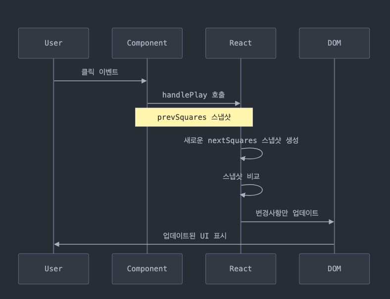

# tic-tac-toe-game 실습

---

1. 초기 환경 구성

- vite custom 템플릿 활용

  ```
  npx degit https://github.com/soyeonpaark/vite-custom.git react-homework
  ```

   </br>

- 타입스크립트 속성 검사 패키지 다운

  ```
  pnpm add @types/prop-types -D
  ```

   </br>

- 파일 구성 진행

📦src
┣ 📂styles
┃ ┗ 📜main.css
┣ 📂tic-tac-toe
┃ ┣ 📂components
┃ ┃ ┣ 📂Board
┃ ┃ ┃ ┗ 📜Board.jsx
┃ ┃ ┣ 📂History
┃ ┃ ┃ ┗ 📜History.jsx
┃ ┃ ┣ 📂Sqaure
┃ ┃ ┃ ┣ 📜Square.jsx
┃ ┃ ┃ ┗ 📜Square.module.css
┃ ┃ ┣ 📂Sqaures
┃ ┃ ┃ ┣ 📜Squares.jsx
┃ ┃ ┃ ┗ 📜Squares.module.css
┃ ┃ ┗ 📂Status
┃ ┃ ┃ ┗ 📜Status.jsx
┃ ┣ 📜Game.jsx
┃ ┗ 📜constants.js
┗ 📜main.jsx

   </br>

2. Square 컴포넌트

- 속성(props)에 따라 화면에 어떻게 렌더링 되어야 하는가

  - 초기에 아무 컨텐츠 표시 x
  - 액션이 있을 시, 화면 표시
  - 이미 액션 처리가 되었다면, 화면에 아무런 변화 x
    => childeren(칸에 표시될 내용)으로 받은 뒤, 존재 여부에 따라 불리언 값이 필요함 (이중 부정 연산자)

  - 속성 검사 진행
  - CSS 모듈 설정

3. Squares 컴포넌트

- constants.js

  ```js
  export const INITIAL_SQUARES = Array(9).fill(null);

  export const PLAYER_COUNT = Object.keys(PLAYER).length;
  ```

=> squares 배열 데이터 초기 상태 값은 9개 null → 순환하여 list Rendering
=> 초기 렌더링 값은 불변
=> 플레이어 수

- Squares.jsx

  - 게임 상태

  ```jsx
  const [squares] = useState(INITIAL_SQUARES);
  ```

  => useState 리액트 훅
  => squares 상태 초기화 (이때 값은 INITAL_SQUARES)
  => 각 squares 요소에 Sqaure 컴포넌트 생성
  => key props를 통한 식별
  <br/>

     <br/>
     
     - 게임 순서

  ```jsx
  const gameIndex = squares.filter(Boolean).length % PLAYER_COUNT;
  console.log(gameIndex);
  ```

  => 불리언 값만 필터링된 것의 길이 나누기 플레이어 수
  => 0: 첫 번째 플레이어, 1: 두 번째 플레이어
  => Boolean 내장 함수 (네이티브) 참조로 사용해 연결
  <br/>

  - 게임 상태 업데이트

  ```jsx
  // 게임 상태 업데이트
  const handlePlay = (index) => () => {
    console.log(`play game #${index}`);
  };

  // ...

  return (
    <div className={S.component}>
      {squares.map((square, index) => {
        return (
          <Square key={index} onPlay={handlePlay(index)}>
            {square}
          </Square>
        );
      })}
    </div>
  );
  ```

  => onPlay: 각 Square를 클릭했을 때 실행되는 함수
  => 그럼 몇 번째 칸인지 어떻게 식별하는가
  => onPlay={handlePlay(index)} 렌더링 되는 즉시 실행이 되므로, 분리 필요: 고차 함수(클로저) 활용? (모르겠음)

  ```jsx
  // 상태 관리
  const [squares, setSquares] = useState(INITIAL_SQUARES);

  // 새로운 상태
  const handlePlay = (index) => () => {
    setSquares((prevSquares) => {
      const nextSquares = prevSquares.map((square, squareIndex) => {
        if (squareIndex === index) {
          return currentPlayer;
        }

        return square;
      });

      return nextSquares;
    });
  };
  ```

  => prevSquares: 현재 게임 보드 상태
  => map (?)
  => 각 칸마다 클릭한 칸인지 확인: `if (squareIndex === index)` (?)
  => 리액트는 스냅샷(특정 시점의 상태를 나타내는 불변의 데이터)처럼 작동한다!
  => 즉, 반환한 값이 다음 번 렌더링에서의 상태값

  
  <br/>

  - 플레이어 순서

  ```jsx
  // 첫 번째 플레이어의 턴
  const isPlayerOneTurn = gameIndex % PLAYER_COUNT === 0;

  // 현재 플레이어
  const currentPlayer = isPlayerOneTurn ? PLAYER.ONE : PLAYER.TWO;
  console.log(currentPlayer);
  ```

  =>
